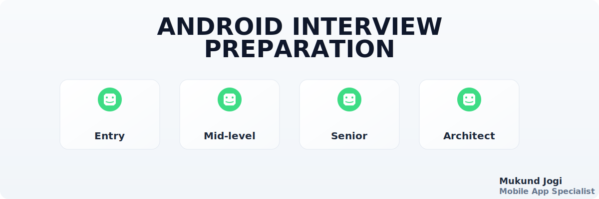

# Android Interview Preparation Guide

<p align="center">
  
  <br/>
</p>

[](https://github.com/mukundjogi/android-interview)
[](https://github.com/mukundjogi/android-interview/network/members)
[](docs/QUESTIONS_INDEX.md)
[](LICENSE)

> **Your complete guide to mastering Android interviews and landing your dream job**

## 📋 Overview

This is the most comprehensive Android Interview Preparation repository available. It covers **everything** you need to know for Android interviews at top tech companies like Google, Meta, Amazon, and Netflix.

### 🎯 What's Inside?

- **120+ Interview Questions** with detailed answers
- **600+ Production-Ready Kotlin Code Examples**
- **15+ Comprehensive Topics** covering all aspects of Android
- **Architecture Patterns**: MVVM, MVI, Clean Architecture
- **Modern Android**: Jetpack Compose, Coroutines, Flows, KMM
- **Best Practices** from industry experts
- **Real-world Scenarios** and use cases

## 📚 Complete Topic Coverage

| # | Topic | Questions | Focus Areas |
|---|-------|-----------|-------------|
| 1 | [Introduction](docs/introduction.md) | 7 | Interview strategies, preparation timeline |
| 2 | [Android Basics](docs/android-basics.md) | 7 | Lifecycle, Intents, Permissions |
| 3 | [Kotlin Programming](docs/kotlin-programming.md) | 8 | Null safety, Coroutines, Scope functions |
| 4 | [Java vs Kotlin](docs/java-vs-kotlin.md) | 10 | Language comparison, Migration |
| 5 | [Android Architecture](docs/android-architecture.md) | 12 | MVVM, MVI, Clean Architecture |
| 6 | [Jetpack Compose](docs/jetpack-compose.md) | 10 | State management, Recomposition |
| 7 | [MVI Pattern](docs/mvi-pattern.md) | 8 | Unidirectional data flow |
| 8 | [Android KMM](docs/android-kmm.md) | 7 | Multiplatform development |
| 9 | [Coroutines & Flows](docs/coroutines-flows.md) | 10 | Async programming, StateFlow |
| 10 | [Data Persistence](docs/data-persistence.md) | 7 | Room, DataStore, Offline-first |
| 11 | [Networking](docs/networking.md) | 8 | Retrofit, OkHttp, Ktor |
| 12 | [Dependency Injection](docs/dependency-injection.md) | 7 | Hilt, Koin, Dagger |
| 13 | [Memory Management](docs/memory-management.md) | 7 | GC, Memory leaks, Optimization |
| 14 | [Testing](docs/testing.md) | 7 | Unit, Integration, UI tests |
| 15 | [Gradle & Maven](docs/gradle-maven.md) | 7 | Build system mastery |
| 16 | [Publishing to Play Store](docs/publishing-play-store.md) | 9 | Complete publishing guide |
| 17 | [Security](docs/security.md) | 7 | App security, SSL Pinning |
| 18 | [Advanced Topics](docs/advanced-topics.md) | 7 | Enterprise-level concepts |

**Total: 120+ Questions | 600+ Code Examples | 100% Coverage**

## 🚀 Quick Start Guide

### For Entry-Level Developers (0-2 years)

**Week 1-2**: Fundamentals
- 📘 [Introduction](docs/introduction.md)
- 📘 [Android Basics](docs/android-basics.md)
- 📘 [Kotlin Programming](docs/kotlin-programming.md)

**Week 3-4**: Core Concepts
- 📗 [Java vs Kotlin](docs/java-vs-kotlin.md)
- 📗 [Data Persistence](docs/data-persistence.md)
- 📗 [Networking](docs/networking.md)

### For Mid-Level Developers (2-4 years)

**Focus Areas**:
- 📘 [Android Architecture](docs/android-architecture.md)
- 📘 [Coroutines & Flows](docs/coroutines-flows.md)
- 📘 [Jetpack Compose](docs/jetpack-compose.md)
- 📘 [Dependency Injection](docs/dependency-injection.md)

### For Senior Developers (4+ years)

**Master These**:
- 📙 [MVI Pattern](docs/mvi-pattern.md)
- 📙 [Android KMM](docs/android-kmm.md)
- 📙 [Memory Management](docs/memory-management.md)
- 📙 [Testing](docs/testing.md)
- 📙 [Security](docs/security.md)

### For Android Architects

**Deep Dive Into**:
- 📕 [Advanced Topics](docs/advanced-topics.md)
- 📕 [Gradle & Maven](docs/gradle-maven.md)
- 📕 [Publishing to Play Store](docs/publishing-play-store.md)

## 📖 How to Use This Guide

### Method 1: Study by Topic (Recommended)
```
1. Pick a topic from the list
2. Read the explanations thoroughly
3. Study all code examples
4. Try answering questions before reading solutions
5. Implement code examples yourself
6. Move to the next topic
```

### Method 2: Mock Interview Preparation
```
1. Go through questions in each topic
2. Practice answering out loud
3. Write code on whiteboard/paper
4. Review best practices
5. Focus on weak areas
```

### Method 3: Quick Review
```
1. Use QUESTIONS_INDEX.md for quick lookup
2. Focus on frequently asked questions
3. Review code examples for important topics
4. Update your knowledge base
```

## 📊 Coverage Statistics

| Category | Count |
|----------|-------|
| **Topics Covered** | 15+ |
| **Interview Questions** | 120+ |
| **Code Examples** | 600+ |
| **Architecture Patterns** | 8+ |
| **Best Practices** | 50+ |
| **Real-world Scenarios** | 100+ |

## 🎓 Learning Path

### Foundation (Month 1)
- ✅ Android Basics
- ✅ Kotlin Programming
- ✅ Java vs Kotlin
- ✅ Data Persistence
- ✅ Networking

### Intermediate (Month 2)
- ✅ Android Architecture
- ✅ Dependency Injection
- ✅ Coroutines & Flows
- ✅ Memory Management
- ✅ Testing

### Advanced (Month 3)
- ✅ Jetpack Compose
- ✅ MVI Pattern
- ✅ Security
- ✅ Advanced Topics
- ✅ Android KMM

### Expert (Month 4)
- ✅ Gradle & Maven
- ✅ Publishing to Play Store
- ✅ Architecture Design
- ✅ Performance Optimization
- ✅ Team Leadership Skills

## 🤝 Contributing

We welcome contributions! Here's how you can help:

1. **Report Issues**: Found a bug? Open an issue
2. **Suggest Improvements**: Have ideas? Share them
3. **Submit Pull Requests**: Improve content or add examples
4. **Share with Friends**: Help others prepare for interviews

See [CONTRIBUTING.md](CONTRIBUTING.md) for detailed guidelines.

## 📝 License

This project is licensed under the MIT License - see the [LICENSE](LICENSE) file for details.

## 🙏 Acknowledgments

- Android Developer Community
- JetBrains for Kotlin
- Google for Android
- All contributors who made this guide possible

## 📞 Contact & Support

- **Issues**: [GitHub Issues](https://github.com/mukundjogi/android-interview/issues)
- **Discussions**: [GitHub Discussions](https://github.com/mukundjogi/android-interview/discussions)
- **Email**: jogimukund@gmail.com

---

## 🌟 Star History

If you find this guide helpful, please consider giving it a star ⭐ on GitHub!

<div align="center">

**Made with ❤️ by the Android Developer Community**

</div>

---

## 📌 Important Notes

### ⚠️ Keep Updated
Android ecosystem evolves rapidly. Always check:
- [Android Developers Blog](https://android-developers.googleblog.com/)
- [Kotlin Blog](https://blog.jetbrains.com/kotlin/)
- [Jetpack Release Notes](https://developer.android.com/jetpack/androidx/versions)

### ✅ Best Practices
1. **Practice Coding**: Don't just read, implement!
2. **Mock Interviews**: Practice with friends
3. **Stay Current**: Android changes fast
4. **Understand Why**: Don't memorize, understand
5. **Build Projects**: Apply knowledge in real apps

### 🎯 Interview Tips
- **Research Company**: Understand their tech stack
- **Prepare Questions**: Ask insightful questions
- **Show Enthusiasm**: Be passionate about Android
- **Explain Thought Process**: Walk through solutions
- **Admit When Uncertain**: Honesty is appreciated

---

**Start your journey today and ace your next Android interview! 🚀**
